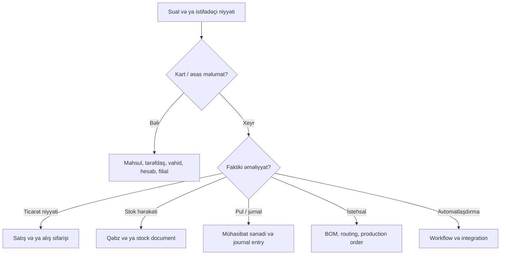

# AI üçün sistem xəritəsi

Bu səhifə ERP haqqında sual cavablayan, kod yazan və ya inteqrasiya quran AI üçün qısa, fakt-yönlü giriş nöqtəsidir. Məqsəd endpoint və entity adlarını təxmin etmədən düzgün domen sərhədini tapmaqdır.

## Əvvəl bu fərqləri qurun

| Anlayış | Nədir | Nə deyil |
| --- | --- | --- |
| Tenant | Bir şirkətin izolə edilmiş biznes məlumatları və database schema-sı. | Filial və ya istifadəçi deyil. |
| Branch | Tenant daxilində əməliyyat scope-u; stok, satış və sənəd görünməsi ilə bağlı kontekst. | Ayrı tenant deyil. |
| Əsas məlumat | `Product`, `Partner`, `Unit`, `Category`, `Account`, `Currency`, `Stock` kimi təkrar istifadə olunan kartlar. | Stok və ya jurnal hərəkəti deyil. |
| Biznes sənədi | Niyyət və ya faktiki əməliyyatı daşıyan başlıq + sətirlər, məsələn `SaleOrder`, `PurchaseReceipt`, `StockDocument`. | Sadəcə UI formu deyil. |
| Post | Qayda yoxlamasından sonra dəyişməz biznes nəticəsi yaradan təsdiq. | Sadə `update` deyil. |
| Reversal/cancel | Post edilmiş nəticəni tarixi silmədən əks yazılışla bağlama. | Səssiz `DELETE` deyil. |
| Projection | Sənəd nəticəsindən hesablanan oxu modeli, məsələn quant, reservation və ya jurnal. | İnteqratorun birbaşa yazmalı olduğu mənbə deyil. |

## Domeni seçmə qaydası

## Etibarlı cavab/implementasiya ardıcıllığı

1. Bu portalda [entity xəritəsindən](../domains/entity-map) biznes obyektini və onun nəticəsini seçin.
2. [Tam route kataloqundan](../api/reference/route-catalog) real path, HTTP method, handler və tenant/filial kontekstini tapın.
3. Dəqiq request və response üçün backend-də həmin handler-dən `Request`/`Data` obyektinə, sonra action/service və presenter-ə keçin. Route kataloqu field kontraktını təxmin etmək üçün istifadə edilməməlidir.
4. `post`, `cancel`, `state`, `confirm`, `release`, `retry` kimi əməliyyatlarda əvvəl [sənəd həyat dövrlərini](../architecture/business-documents) yoxlayın. Onları CRUD update kimi göstərməyin.
5. Cavabda entity, endpoint, context, precondition və biznes təsirini ayrıca bildirin. Kodda yoxdursa bunu fakt kimi təqdim etməyin.

## Dəyişiklik təsir xəritəsi

| Dəyişən sahə | Yoxlanmalı yer | Tipik risk |
| --- | --- | --- |
| Route və middleware | `routes/*.php`, route kataloqu | Public/tenant/branch kontraktının pozulması |
| Request body | Controller, `Request`/`Data`, test | Validation və API compatibility |
| Post/cancel/state | Domain action/service, guard, test | Stok, jurnal, vergi və auditin uyğunsuzluğu |
| Model və migration | Model, migration, metadata, presenter | Schema və UI/API contract uyğunsuzluğu |
| Permission | Route authorization, policy/catalog | İcazəsiz yazma və ya görünmə |
| Tenant/branch | Middleware, repository query, test | Məlumat sızması |

## Mütləq sərhədlər

- Tenant və filial identifikatorlarını başqa tenantdan gələn ID ilə qarışdırmayın.
- Əsas məlumat yaratmaqla stok və maliyyə nəticəsi gözləməyin.
- Post edilmiş sənədi əvvəlcə `PUT` və ya `DELETE` ilə dəyişməyə çalışmayın; onun state/action endpointini və guard qaydasını yoxlayın.
- `JournalEntry`, `StockMove`, reservation və valuation kimi nəticə entity-lərini mənbə sənədin yerinə yaratmayın.
- Endpointin path-i oxşar görünsə belə, real route manifestində yoxdursa onu mövcud saymayın.
