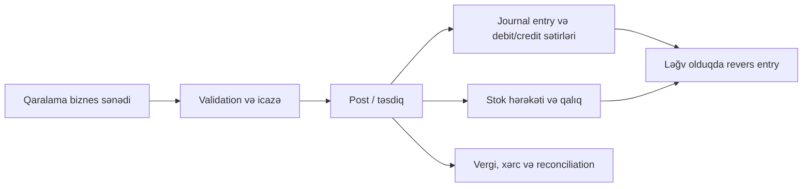
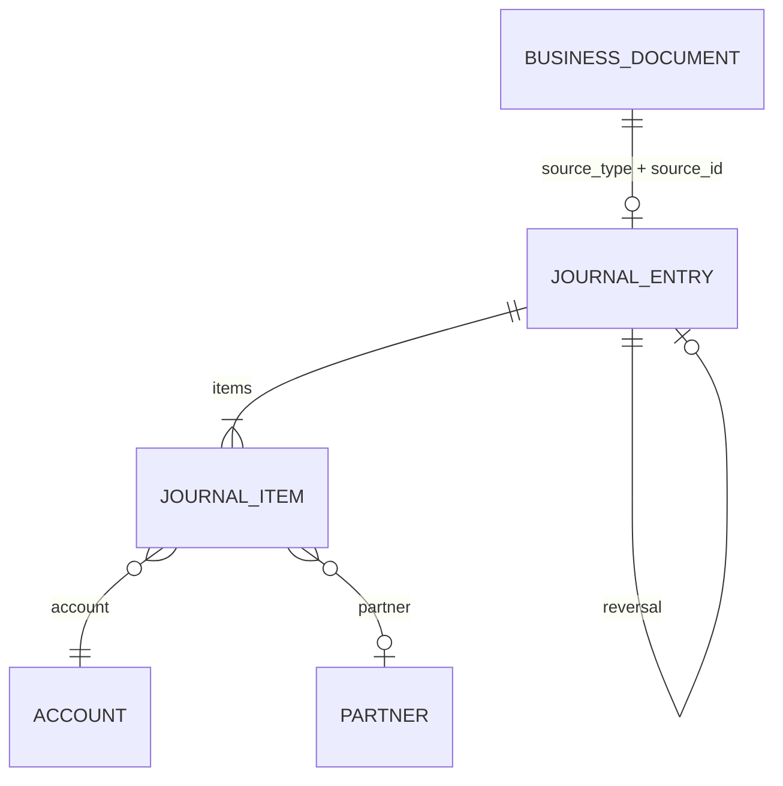

# Biznes sənədləri və sistem təsirləri

ERP-də məhsul, tərəfdaş, hesab, anbar, valyuta və vergi kimi obyektlər **əsas məlumat**dır. Onlar özlüyündə qalıq və ya maliyyə hərəkəti yaratmır. Satış, alış, anbar, ödəniş və istehsal obyektləri isə **biznes sənədi**dir: onların təsdiqlənməsi başqa domenlərə təsir edə bilər.

## Sənədin həyat dövrü

Əksər əməliyyat sənədləri əvvəl `draft` kimi yaradılır. Təsdiq və ya `posted` keçidi yalnız həmin sənədin qaydaları keçdikdən sonra yerinə yetirilir. Post edilmiş sənəd silinmək və səssizcə yenidən yazılmaq üçün nəzərdə tutulmur; ləğv olunanda revers/əks yazılışla audit izi qorunur.



Bu ardıcıllıq bütün sənədlərə eyni qaydada tətbiq edilmir. Məsələn, satış sifarişi kommersiya öhdəliyi və rezervasiya yaradır, amma satış qəbzi kimi birbaşa stok və jurnal post etməz. Hər endpointin konkret təsiri [API endpointləri](../api/endpoints)-də və bu bölmədəki uyğun axında göstərilir.

## Satış və alış

| Sənəd | Təsdiq/post təsiri | Ləğv və dəyişiklik |
| --- | --- | --- |
| Satış sifarişi | `sale_order` vəziyyətinə keçdikdə tələbat üzrə rezervasiyalar yaradır və çatdırılma üçün qaralama anbar sənədini sinxronlaşdırır. | Ləğv və ya yenidən qaralamaya keçid rezervi buraxır; post edilmiş çatdırılma olduqda qayda keçidi məhdudlaşır. |
| Satış qəbzi | Post ediləndə stok çıxışı, uyğun jurnal yazılışı və xərc yazılışı əmələ gəlir. | Ləğv stok/mühasibat nəticələrini revers mexanizmi ilə geri alır. |
| Alış sifarişi | Tədarük öhdəliyini və sifariş sətirlərinin miqdar vəziyyətini saxlayır. | Təsdiqlənmiş sifariş yalnız icazəli vəziyyət keçidləri ilə dəyişir. |
| Alış qəbzi | Post ediləndə stok qəbulu, uyğun jurnal yazılışı və receipt xərcləri işlənir. | Ləğv stok və maliyyə nəticələrini əks əməliyyatla geri alır. |
| Satış/alış qaytarışı | Mənbə qəbzlə əlaqələnərək stok və jurnal nəticəsini əks istiqamətdə yaradır; uyğun olduqda settlement/reconciliation tətbiq olunur. | Mənbə əlaqəsi və artıq uzlaşdırılmış sətirlər qorunur. |

## Anbar və rezervasiya

`stock-documents` resursu qəbul, çıxış, daxili transfer, silinmə və inventar düzəlişini təmsil edir. Post edilmə zamanı sənəd sətirlərindən `stock_moves` yaranır və qalıq proyeksiyası/quant-lar yenilənir. Bu səbəbdən qaralama sənəddə olan məlumat fiziki qalıq demək deyil.

Rezervasiya fiziki qalıqdan ayrıca hesablanır:

```text
əlçatan qalıq = fiziki qalıq − rezerv edilmiş miqdar
```

`stock-reservations` və allocation endpointləri rezervi izləmək, buraxmaq və icazəli olduqda başqa quant-a köçürmək üçündür. Rezervi pozacaq və ya mövcud rezervdən aşağı fiziki qalıq yaradacaq post əməliyyatı biznes xətası ilə rədd edilir.

Stok revaluation və landed cost ayrıca maliyyət düzəlişi sənədləridir. Post ediləndə valuation və uyğun jurnal nəticəsi yaradır, ləğvdə isə revers qaydası işləyir.

## Mühasibat jurnal modeli

Mühasibat nəticəsi biznes sənədinin öz cədvəlində gizlədilmir. Onunla polymorphic bağlı olan `journal_entries` başlığı və `journal_items` debit/credit sətirləri yazılır. `source_type` və `source_id` jurnalın hansı biznes sənədindən yarandığını saxlayır.



Post zamanı jurnal sətirlərinin debit və credit məbləğləri yoxlanır, entry `posted` olur və mənbə sənədin vəziyyəti yenilənir. Vergi sətirləri postdan əvvəl dondurulur. Ləğvdə sistem mövcud uzlaşdırmaları açır, entry-ni revers edir və yeni əks jurnal entry-si ilə iz buraxır; ilkin yazılış tarixçədən silinmir.

Ödənişlər, expense, manual accounting entry, invoice, qaytarış və wallet transfer maliyyə sənədləridir. Onların `state` endpointi `draft`, `posted` və `cancelled` keçidlərini idarə edir. `finance/open-items`, reconciliation və settlement endpointləri post edilmiş jurnal sətirlərində qalıq borcu uzlaşdırır.

## İstehsal və POS

İstehsal sifarişi BOM, routing və iş mərkəzi kontekstində işləyir. Material `consume` əməliyyatı çıxış tipli, məhsul `produce` əməliyyatı isə qəbul tipli stok sənədini yaradır və post edir. İstehsal sifarişinin rezervləri, xərci və traceability hesabatları həmin əlaqəli stok/maliyyə nəticələrindən alınır.

POS-da inzibatçı endpointləri JWT və filial konteksti ilə işləyir. `/v1/pos/sync/*` cihaz endpointləri isə ayrıca `Authorization: Device <tenant-uuid>.<device-secret>` credentialı ilə qorunur. Aktivləşdirmə, bootstrap, push, pull və ack əməliyyatları offline cihazın əməliyyat jurnalını ERP-yə sinxronlaşdırır; POS satış, qaytarış, növbə və kassalı hərəkətlər sonradan ERP oxu endpointlərində görünür.
