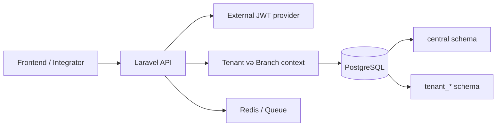

# Sistem arxitekturası

BEIN ERP Laravel əsaslı multi-tenant REST API-dir. Xarici frontend və inteqratorlar HTTP API vasitəsilə işləyir; biznes məlumatları tenant schema-larında, tenant registri və shared metadata isə central schema-da saxlanılır.

## Laylar

| Lay | Məsuliyyət |
| --- | --- |
| API controller | HTTP sorğunu qəbul edir, DTO/service çağırır və standart cavab qaytarır. |
| Data/validation | Spatie Data və request validation ilə input kontraktını təmin edir. |
| Domain service/action | Biznes qaydaları və use-case orkestrasiya. |
| Persistence/model | Tenant kontekstində məlumatın saxlanması və oxunması. |
| Infrastructure | Database runtime, auth/context, queue, cache və xarici servis inteqrasiyası. |

## Əsas qayda

Controller biznes qaydasını daşımamalıdır. Yeni endpoint üçün əvvəl kontrakt, validation, service/action və test hazırlanır; sonra OpenAPI və bu portal yenilənir.
