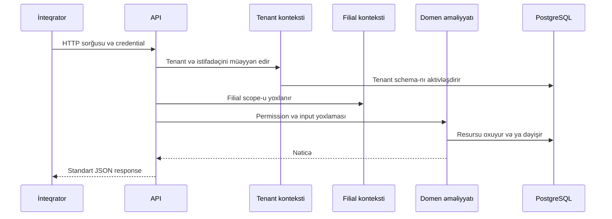

# Sorğunun həyat dövrü

Bu səhifə `v1` API sorğusunun hansı kontekstlərdən keçdiyini izah edir. Endpointin field-ləri, permission adı və status kodları üçün həmişə uyğun API referansını əsas götürün.

## 1. Autentifikasiya və tenant seçimi

Əksər `v1` route-ları Bearer JWT ilə qorunur. Backend credential-dan tenant hesabını və istifadəçi login-ini müəyyən edir, tenantı yoxlayır, sonra tenant database kontekstini aktivləşdirir. Tenant və ya istifadəçi tapılmadıqda sorğu `401` ilə tamamlanır.

Tenant provisioning hələ hazır deyilsə, qorunan route `503` qaytara bilər. Credential formatları və istisna endpointlər üçün [Autentifikasiya və kontekst](../api/authentication) səhifəsinə baxın.

## 2. Filial scope-u

Filial-scope route-larında `X-Branch-Id` seçilmiş əməliyyat kontekstidir. Header verilmədikdə backend istifadəçinin aktiv default və ya əlçatan filialını seçir. Seçilmiş filial aktiv və istifadəçi üçün əlçatan olmalıdır.

`X-Branch-Id: all` yalnız `GET` və `HEAD` üçün oxu kontekstidir. Yazma sorğusunda bu dəyər qəbul edilmir. Request body-də `branch_id` varsa, o seçilmiş filialla eyni olmalıdır; fərqli olduqda sorğu rədd edilir.

## 3. İcazə, input və əməliyyat

Route controller-i əvvəl resursa uyğun `read`, `create`, `update` və ya `delete` permission-ını yoxlayır. İcazə çatmadıqda nəticə `403` olur.

Yazma sorğusu request data kontraktı ilə yoxlanır. Yoxlamadan keçən məlumat domen əməliyyatına verilir; əməliyyat state keçidi, mövcudluq, əlaqəli sənədlər və mühasibat dövrü kimi biznes şərtlərini ayrıca yoxlaya bilər. Buna görə sintaktik cəhətdən düzgün JSON da `422` ilə rədd edilə bilər.

## 4. Nəticə və xəta davranışı

Uğurlu cavab `status`, `message` və `data` zərfində qaytarılır. Siyahı endpointləri pagination məlumatı da qaytara bilər. Cavab zərfi, pagination və standart xəta formatı [API kontraktı](../api/contract) səhifəsindədir.

Bir biznes sənədinin post və ya cancel əməliyyatı stok, jurnal və digər nəticələri eyni domen əməliyyatında yarada və ya geri ala bilər. Bu təsirlərin ümumi izahı [Biznes sənədləri](./business-documents), konkret kontraktı isə həmin resursun endpoint səhifələrində verilir.
