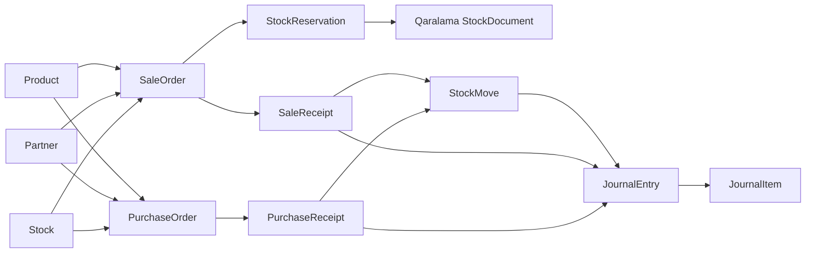

# Resurslar və əlaqələr

Bu xəritə əsas resursların ERP-dəki rolunu və tipik ardıcıllığını göstərir. Resursun dəqiq field-ləri, endpointləri və permission-ları onun API referansında verilir.

## Resurs qrupları

| Qrup | Resurslar | Rolu | Əlaqəli növbəti əməliyyat |
| --- | --- | --- | --- |
| Əsas məlumat | `Product`, `Partner`, `Category`, `Unit`, `Branch`, `Stock` | Sənədlərin istifadə etdiyi daimi identifikator və sazlamaları saxlayır. | Məhsul və tərəfdaşı sifariş və ya qəbz sətirində istifadə edin. |
| Kommersiya öhdəliyi | `SaleOrder`, `PurchaseOrder` | Gələcək satış və ya alış niyyətini, tərəfi, anbarı və sətirləri saxlayır. | Sifarişdən qəbz və ya digər törəmə sənəd yaradın. |
| Faktiki stok əməliyyatı | `SaleReceipt`, `PurchaseReceipt`, `StockDocument`, `StockMove` | Fiziki çıxış, qəbul və ya daxili hərəkətin mənbəyini və nəticəsini saxlayır. | Post edilmiş nəticəni stok və maliyyə hesabatlarında izləyin. |
| Mövcudluq | `StockReservation`, allocation, quant | Tələbin hansı hissəsinin rezerv olunduğunu və hansı stok quant-ına ayrıldığını saxlayır. | Rezervi oxuyun, lazım olduqda `release`, `retry` və ya icazəli `reallocate` əməliyyatından istifadə edin. |
| Maliyyə izi | `JournalEntry`, `JournalItem`, expense | Post edilmiş biznes sənədinin debit/credit və əlaqəli xərc nəticəsini saxlayır. | Açıq mövqeləri, reconciliation və maliyyə hesabatlarını oxuyun. |

## Əlaqə xəritəsi

## Satış axını

`Product`, müştəri `Partner`-i, `Stock` və sətirlər əvvəl [Satış sifarişində](/docs/api/sales/orders) istifadə oluna bilər. `SaleOrder` üçün `draft`, `sent`, `sale_order` və `cancelled` state-ləri mövcuddur.

`sale_order` state-i seçildikdə və avtomatik rezervasiya siyasəti aktiv olduqda stokda izlənən məhsul sətirləri üçün `StockReservation` yaradılır; həmin proses qaralama çatdırılma `StockDocument`-ini də sinxronlaşdırır. Aktiv törəmə sənəd və ya post edilmiş çatdırılma/qəbz varsa sifarişin bu state-dən çıxarılması məhdudlaşdırılır.

Faktiki satış üçün [Satış qəbzi](/docs/api/sales/receipts) yaradılır. Onun `posted` keçidi stok çıxışı, jurnal yazılışı, vergi tanınması və qəbz xərclərinin post edilməsini bir transaction-da işləyir. `cancelled` keçidi stok nəticəsini geri çevirir, rezervi bərpa edir və bağlı jurnal yazılışını revers edir.

## Alış axını

[Alış sifarişi](/docs/api/purchasing/orders) təchizatçı, təyinat anbarı və sətirlər üçün kommersiya sənədidir. `confirmed` keçidində sətir vergiləri dondurulur, lakin bu keçid təkbaşına stok hərəkəti və jurnal yazılışı yaratmır. Aktiv törəmə sənədlər qaldıqda `cancelled` keçidi rədd edilir.

[Alış qəbzi](/docs/api/purchasing/receipts) sifarişdən və ya birbaşa yaradıla bilər. `posted` keçidi stok qəbulunu, jurnal yazılışını və qəbz xərclərini işləyir; `cancelled` keçidi stok və jurnal nəticələrini geri çevirir. Alış qəbzi sətirləri post edilmiş `StockMove` nəticələrinin mənbəyidir.

## Master data ilə sənədin fərqi

[Məhsul kartının](/docs/api/catalog/products) yaradılması və redaktəsi özlüyündə stok hərəkəti və jurnal yazılışı yaratmır. Məhsulun stok izlənməsi məhsul tipi ilə müəyyən edilir; yalnız stokda izlənən məhsul sətirləri post zamanı stok emalına daxil olur.

Bu fərq inteqrasiya üçün vacibdir: məhsulu yaratmaq qalıq artırmaq demək deyil, sifarişi yaratmaq isə faktiki satış və ya alış demək deyil. Fiziki və maliyyə nəticəsi uyğun biznes sənədinin `posted` əməliyyatından yaranır.

## Resurslar üzrə sənəd oxu qaydası

1. Əvvəl resursun icmal səhifəsindən onun biznes rolunu və növbəti addımı seçin.
2. Sonra həmin resursun endpoint səhifəsindən tam request/response kontraktını istifadə edin.
3. State dəyişdirərkən yalnız resurs üçün göstərilən state dəyərlərini göndərin.
4. Post edilmiş nəticəni stok, jurnal və əlaqəli sənəd endpointlərindən oxuyun; request body-də bu nəticələri əl ilə yaratmağa çalışmayın.
