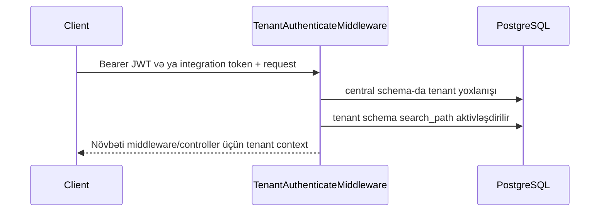

# Tenant və filial modeli

Sistem bir PostgreSQL database içində schema-per-tenant modelindən istifadə edir.

- `central` schema tenant registri və shared sistem məlumatlarını saxlayır.
- Hər tenant `tenant_<account>` schema-sında öz biznes məlumatlarına sahibdir.
- Bearer credential-dan tenant və istifadəçi müəyyən edilir: xarici JWT login məlumatı ilə, integration token isə bağlı integration client və user ilə həll olunur. Middleware həmin tenant üçün database context-i aktivləşdirir.
- Branch context əməliyyat məlumatlarını filial səviyyəsində daraldır.

Schema tenancy PostgreSQL session state-dən istifadə etdiyinə görə tenant traffic üçün transaction və statement pooling uyğun deyil; direct connection və ya session-mode pool istifadə olunmalıdır.
