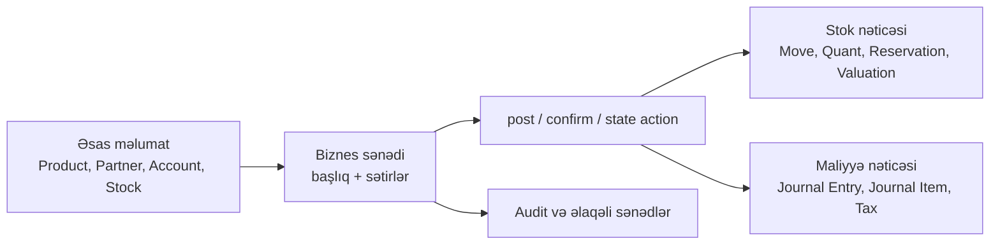

# ERP entity xəritəsi

Bu xəritə sistemin biznes dilini izah edir. Tam texniki model siyahısı [entity/model inventarında](./entity-inventory), endpointlərin tam siyahısı isə [route kataloqundadır](../api/reference/route-catalog).

## Əsas qayda: kart, sənəd və nəticə

`Product` və `Partner` kartdır: təkbaşına hərəkət yaratmır. `SaleReceipt`, `PurchaseReceipt`, `StockDocument`, `SaleInvoice` kimi sənədlər isə bir məqsəd və sətirləri birləşdirir. `post` və ya icazəli state keçidi nəticəni yaradır. Bu ayrım API inteqrasiyasının ən vacib hissəsidir.

## Domenlər və əsas entity-lər

| Domen | Əsas entity-lər | Nəyi idarə edir | Əsas nəticə / əlaqə |
| --- | --- | --- | --- |
| Shared | `Branch`, `Project`, `DocumentNumberConfiguration`, `DocumentNameAssignment` | Tenant daxili təşkilati və sənəd identifikasiyası. | Bütün branch-scoped sənədlər. |
| Product | `Product`, `ProductTemplate`, `Category`, `Unit`, `ProductPackaging`, `ProductAttribute`, `ProductPrice`, `BranchProductSetting` | Satılan/alınan/istehsal edilən məhsulun kartı, ölçüsü və variantı. | Sifariş, qəbz, BOM və stok sətirləri. |
| Partner | `Partner`, `PartnerGroup`, `PartnerBankAccount` | Müştəri, təchizatçı və digər qarşı tərəf. | Kommersiya sənədləri, açıq borc və ödəniş. |
| Sales | `SaleOrder` + `SaleOrderItem`; `SaleReceipt` + `SaleReceiptItem` | Satış niyyəti və faktiki satış. | Rezervasiya, çıxış stok hərəkəti, vergi və jurnal. |
| Purchase | `PurchaseOrder` + `PurchaseOrderItem`; `PurchaseReceipt` + `PurchaseReceiptItem` | Alış niyyəti və fiziki qəbul. | Qəbul stok hərəkəti, maya dəyəri və jurnal. |
| Stock | `StockDocument` + `StockDocumentItem`, `StockMove`, `StockQuant`, `StockReservation`, `StockLot`, `StockLocation`, `StockReorderRule`, `StockRevaluation` | Anbar, fiziki hərəkət, əlçatanlıq, lot və maya dəyəri. | Qalıq/valuation proyeksiyası və maliyyə nəticəsi. |
| Accounting | `Account`, `JournalEntry` + `JournalItem`, `Wallet`, `Currency`, `SaleInvoice`, `PurchaseInvoice`, `DirectExpense`, `*Return`, `FixedAsset*` | Hesab planı, debit/credit, pul və maliyyə sənədləri. | Open item, settlement, reconciliation, maliyyə hesabatı. |
| Manufacturing | `Bom` + components/outputs, `Routing`, `WorkCenter`, `ProductionOrder`, `MaterialConsumption`, `ProductionOutput` | Məhsul ağacı, əməliyyat marşrutu və istehsal. | Material çıxışı, hazır məhsul qəbulu, xərc və traceability. |
| POS | `PosRegister`, `PosShift`, `PosSale`, `PosSaleReturn`, `PosCashMovement`, `PosPaymentType`, `PosSyncIssue` | Kassir əməliyyatları və offline cihaz sinxronu. | ERP oxu modellərinə satış/qaytarış/kassa nəticələri. |
| CRM | `Lead`, `Pipeline`, `Stage`, `Task`, `Source`, `LostReason` | Satışdan əvvəl lead və fəaliyyət izlənməsi. | Tərəfdaş və kommersiya prosesinə keçid. |
| HR | `Department` | Şöbə iyerarxiyasını və məsul struktur vahidini saxlayır. | Məhsul, user və proseslərdə department scope-u. |
| Qiymət siyasəti | `PriceType` | Satış və sənəd sətirlərində seçilən qiymət tipini saxlayır. | Məhsul qiymətləri, sifariş və qəbz sətirləri. |
| Lokallaşdırma və vergi profili | `TaxProfile`, `TaxRegistration`, `LocalizationInstallation`, `LocalizationInstallRun` | Ölkəyə məxsus vergi profilini, qeydiyyatı və localization quraşdırma tarixçəsini saxlayır. | Vergi validation-u, hesab və metadata default-ları. |
| Workflow | `WorkflowDefinition`, `WorkflowRun`, `WorkflowStepRun`, `WorkflowEvent` | Trigger əsaslı avtomatlaşdırma və icra tarixi. | Domen əməliyyatı, notification və audit. |
| Integrations / Network | `IntegrationConnection`, outbox/delivery; `NetworkProfile`, `NetworkConnection`, `NetworkExchange`, `NetworkVersion` | Xarici connector və şirkətlərarası sənəd mübadiləsi. | İdempotent çatdırılma, retry, qəbul/rədd tarixi. |
| Onlayn mağaza | `Storefront`, `StoreProductPublication` | Tenant mağazasının public identifikatorunu, görünüş sazlamasını və yayımlanan məhsulları idarə edir. | `/api/store/v1/{store}` public kataloq oxuları. |
| Output / reporting | `OutputTemplate`, revision/assignment; report definitions | Sənədin çap/HTML çıxışı və hesabat quruluşu. | Sənəd məlumatının oxu və yayımlanmış şablon. |
| Platform və giriş | `Tenant`, `User`, `Role`, `Permission`, `AuthorizationPolicy`, `IntegrationClient` | Tenant identity, istifadəçi, rol/icazə siyasəti və integration credential metadata-sını saxlayır. | Auth, authorization, audit və tenant contexti. |

## Ən vacib sənəd zəncirləri

| Biznes məqsədi | Mənbə | Keçid | Nəticə |
| --- | --- | --- | --- |
| Satış planı | `SaleOrder` | `sale_order` state-i, siyasət aktivdirsə | `StockReservation` və qaralama çatdırılma sənədi. |
| Faktiki satış | `SaleReceipt` | `posted` | Stok çıxışı, jurnal, vergi/xərc nəticəsi. |
| Alış planı | `PurchaseOrder` | Təsdiq state-i | Tədarük öhdəliyi; təkbaşına fiziki stok deyil. |
| Faktiki alış | `PurchaseReceipt` | `posted` | Stok qəbulu, maya dəyəri və jurnal nəticəsi. |
| Anbar düzəlişi | `StockDocument` | `post` | `StockMove`, quant/qalıq və valuation dəyişikliyi. |
| Maliyyə əməliyyatı | Maliyyə sənədi | `posted` | Balanslı `JournalEntry` və `JournalItem` sətirləri. |
| İstehsal | `ProductionOrder` | consume / produce | Material çıxışı, məhsul qəbulu, traceability. |

Post edilmiş nəticələr qorunan tarixçədir. Dəyişiklik üçün uyğun `cancel`, reversal və ya state transition istifadə olunur; entity-ni birbaşa silmək və ya nəticə cədvəlini əl ilə yazmaq doğru inteqrasiya modeli deyil.
